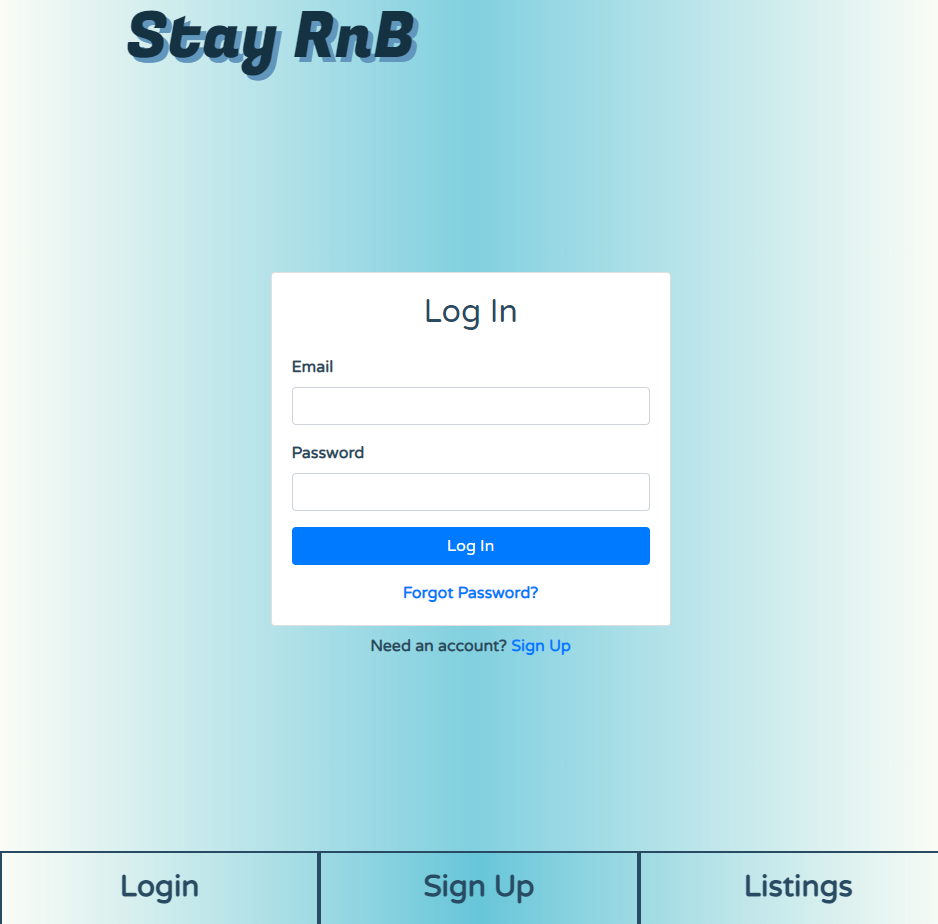
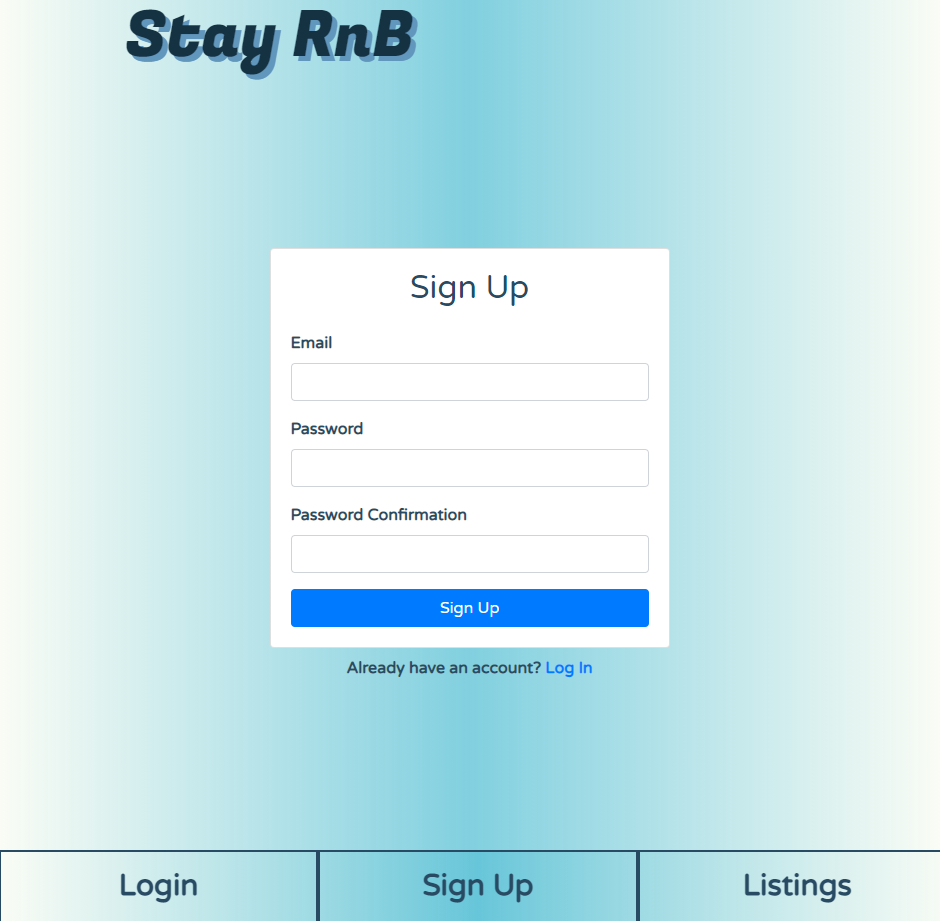

# Stay-RnB

License: 

Application for booking room and boarding when you don't need a full apartment or house for rent. When you are looking for the minimum place to stay and sleep without the hassle of paying for full apartments or houses, we are here to solve your problem. Our application will connect the users with property owners that will host their available rooms for boarding. Property owners who have spare bedrooms who want to connect with people can come sign up to get with users who might need a room for boarding that are looking in the area. 

Firebase Web Deployment: https://stay-rnb.herokuapp.com/
Full Stack MERN: https://stay-rnb-server.herokuapp.com/

# Mobile-App Version
Repo: https://github.com/erumd/Stay-RnB-Mobile
Deployment: To be deployed to the Play Store on Android & Apple Store on iOS
Deployment of the mobile app will be at a later time

# Server-Side
Repo: https://github.com/Joeseff6/Stay-RnB-Backend
Deployment: https://stay-rnb-server.herokuapp.com/

# Team members
Erum Dhukka - Mobile application development
  - GitHub: https://github.com/erumd
  - Email: erumdhukka531@gmail.com

Joseph Soria - Server-side development/MERN
  - Deploy: https://stay-rnb-server.herokuapp.com/
  - GitHub: https://github.com/Joeseff6
  - Email: josephsoria6@gmail.com

Tony Tran - Desktop/React application development/Project Manager
  - GitHub: https://github.com/code-monkey713
  - Email: tony.tran713@outlook.com

## Description 

This application will allow the users to sign up to look for and get in contact with owners who are hosting rooms for rent in a longer stay but are not ready for a full apartment with contracts and such.  

Screenshots:

## Table of Contents

* [Installation](#installation)
* [Usage](#usage)
* [License](#license)
* [Contributing](#contributing)
* [Tests](#tests)
* [Questions](#questions)
* [References](#references)

## Installation

You can use the deployed application at the beginning of this readme. 

## Usage 

Here are some features of this application. Some of the features are to be released at a later time. 

  - user can signup to get listing information and contact host for boarding
  - host can signup to list their rooms for boarding
  - host can look for users who are looking for boarding in the area of interest
  - host can upload images of their listing for other users to browse

## License

MIT

## Contributing

If you would like to contribute to this project, you can fork a copy of the repo and make changes or improvements on your repo. Once ready, you can request a push and I will review the changes before updating the repo. 

## Tests

There are no tests with this application. Let me know if you are interested in creating a test for this application. 

## Questions

If you have any questions, feel free to contact me directly and listed below are my contact informations. 

GitHub profile: code-monkey713

Email: tony.tran713@outlook.com

## References

https://rnfirebase.io/
https://blog.logrocket.com/getting-started-react-redux-firebase/
https://temp-mail.org/
https://css-tricks.com/intro-firebase-react/
https://snack.expo.io/
https://rnfirebase.io/
https://reactnative.dev/
https://reactjs.org/
https://easybase.io/docs/easybase-react/
